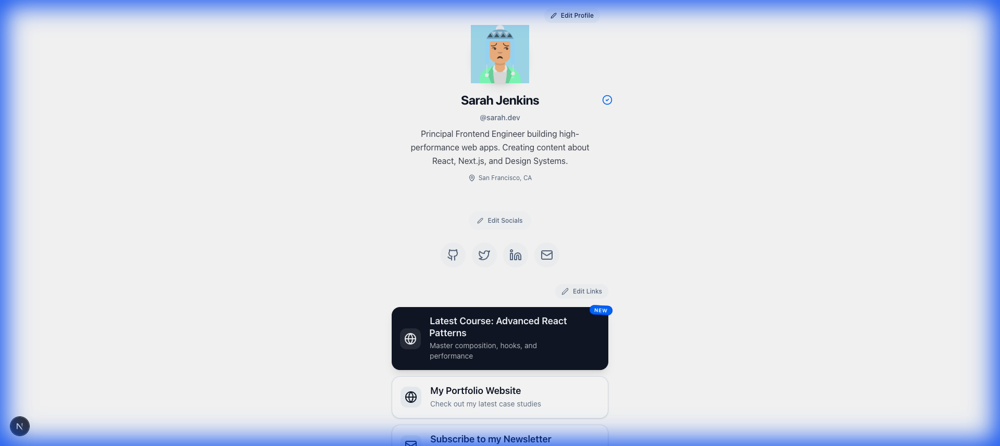

# Link-Nexo

**Link-Nexo** is a full-stack "Link in Bio" application built with Next.js, React 19, TypeScript, Drizzle ORM, and NeonDB. It gives users a personalized, publicly accessible profile page to showcase their links and social media handles — all managed through a secure, authenticated admin dashboard.



---

## 🚀 Features

### **Authentication**
- **Credentials-based login** with bcrypt password hashing (NextAuth.js v5 + JWT strategy)
- **Protected routes** via Next.js middleware — `/admin` requires authentication, `/login` redirects authenticated users away
- **Auto-account creation** on first sign-in for easy onboarding

### **Profile Management**
- **Custom handle** — each profile has a unique URL handle (e.g. `/yourusername`)
- **Bio & Location** — editable profile metadata
- **Avatar** — custom profile image support
- **Verification Badge** — mark accounts as verified
- **Section Visibility** — toggle the visibility of profile sections without deleting data

### **Social Links**
- **Multi-platform support** — GitHub, Twitter/X, LinkedIn, YouTube, Instagram, Email, and generic websites
- **Drag-and-Drop Sorting** — reorder social icons with a smooth dnd-kit interface
- **Toggle Visibility** — hide or show individual platforms without deleting them

### **Link Management**
- **Add / Edit / Delete Links** — full CRUD operations via authenticated server actions
- **Drag-and-Drop Reordering** — order links with optimistic UI updates
- **Visibility Toggle** — hide individual links from the public view
- **Icon Assignment** — associate an icon type with each link

### **Public Profile Pages**
- **Dynamic routing** via `[handle]` — each user's profile is publicly accessible at `/{handle}`
- **Read-only view** — public pages render links and socials without any editing controls
- **Server-rendered** for fast load times and SEO

### **Editor Experience**
- **Inline WYSIWYG editing** — edit your profile directly on the admin dashboard, no separate forms
- **Instant feedback** — toast notifications for all save, delete, and reorder actions
- **Optimistic UI** — interactions feel instant with no loading spinners

---

## 🛠️ Tech Stack

| Layer | Technology |
|---|---|
| Framework | [Next.js 16](https://nextjs.org/) (App Router) |
| Language | [TypeScript 5](https://www.typescriptlang.org/) |
| Runtime | [React 19](https://react.dev/) |
| Styling | [Tailwind CSS v4](https://tailwindcss.com/) |
| Animations | [Framer Motion](https://www.framer.com/motion/) |
| Drag & Drop | [dnd-kit](https://dndkit.com/) |
| ORM | [Drizzle ORM](https://orm.drizzle.team/) |
| Database | [Neon Serverless Postgres](https://neon.tech/) |
| Auth | [NextAuth.js v5](https://authjs.dev/) (Credentials + JWT) |
| Icons | [Lucide React](https://lucide.dev/) |
| Validation | [Zod](https://zod.dev/) |

---

## 🗄️ Data Model

```
users ──────< accounts
  │
  └──────── profiles ──────< links
                     └──────< socials
```

| Table | Key Fields |
|---|---|
| `user` | `id`, `name`, `email`, `password`, `image` |
| `account` | `userId`, `provider`, `providerAccountId` (OAuth support) |
| `session` | `sessionToken`, `userId`, `expires` |
| `profile` | `id`, `userId`, `handle` (unique), `bio`, `location`, `avatarUrl`, `verified`, `sectionVisibility` |
| `link` | `id`, `profileId`, `title`, `href`, `icon`, `visible`, `order` |
| `social` | `id`, `profileId`, `platform`, `href`, `label`, `visible`, `order` |

---

## 📁 Project Structure

```
src/
├── app/
│   ├── [handle]/        # Public profile pages (dynamic route)
│   ├── admin/           # Authenticated admin dashboard
│   ├── login/           # Login page
│   ├── settings/        # User settings
│   ├── api/             # API route handlers (NextAuth)
│   └── actions.ts       # Server Actions (profile, link CRUD)
├── auth.ts              # NextAuth configuration
├── middleware.ts         # Route protection middleware
├── db/
│   ├── schema.ts        # Drizzle schema definitions
│   └── index.ts         # Neon DB connection
├── components/          # Shared UI components
├── types/               # TypeScript type definitions
└── lib/                 # Utility helpers
```

---

## 🏃‍♂️ Getting Started

### Prerequisites

- **Node.js** 18+
- A [Neon](https://neon.tech/) Postgres database (free tier works)

### 1. Clone the repository

```bash
git clone https://github.com/yourusername/link-nexo-app.git
cd link-nexo-app
```

### 2. Install dependencies

```bash
npm install
```

### 3. Configure environment variables

Create a `.env.local` file in the root of the project:

```bash
# Database (Neon Postgres)
DATABASE_URL="postgresql://..."

# Auth
AUTH_SECRET="your-secret-here"   # generate with: openssl rand -base64 32
NEXTAUTH_URL="http://localhost:3000"
```

### 4. Push the database schema

```bash
npx drizzle-kit push
```

### 5. (Optional) Seed the database

```bash
npx tsx scripts/seed.ts
```

### 6. Run the development server

```bash
npm run dev
```

Open [http://localhost:3000](http://localhost:3000) in your browser.

---

## 📜 Available Scripts

| Script | Description |
|---|---|
| `npm run dev` | Start the development server |
| `npm run build` | Build for production |
| `npm run start` | Start the production server |
| `npm run lint` | Run ESLint |
| `npx drizzle-kit push` | Push schema changes to the database |
| `npx drizzle-kit studio` | Open Drizzle Studio (DB GUI) |
| `npx tsx scripts/seed.ts` | Seed the database with sample data |

---

## 🤝 Contributing

Contributions are welcome! Please feel free to submit a Pull Request.

## 📄 License

This project is open source and available under the [MIT License](LICENSE).
